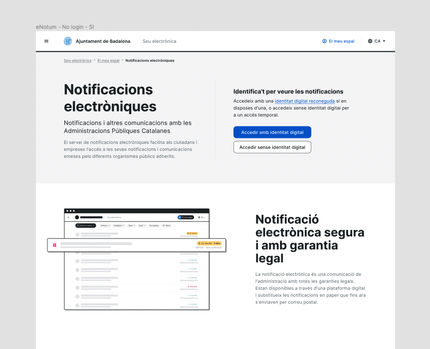

# Encapçalaments

## Regles que s'han de complir sempre:  
- Només un H1 per pàgina.
- No poden haver-hi salts de nivell. És a dir, no es pot passar d'un H2 a un H4.

Més informació sobre headings [al web de la WAI](https://www.w3.org/WAI/tutorials/page-structure/headings/).

## Com testejar-ho?
- Hi ha diverses extensions que ens poden treure el llistat d'encapçalaments. Com ara [HeadingsMap.](https://chrome.google.com/webstore/detail/headingsmap/flbjommegcjonpdmenkdiocclhjacmbi?hl=en)
- Tots els lectors de pantalla tenen funcionalitat per treure una llista d'encapçalaments.

## Estructura d'encapçalaments pels serveis AOC
- En el cas d'AOC el H1 serà el títol de la pàgina, del contingut.  
-  A partir d'aquí s'hauran de definir la resta d'encapçalaments sense salts de nivell
- El logo que hi hagi al `<header>` l'entendrem com enllaç de navegació. És a dir, té la funcionalitat d'anar en qualsevol moment a la pàgina d'inici. Perquè sigui accessible deixarem l'atribut alt de la imatge vuit i afegirem un aria-label a l'enllaç amb el text "AOC, ves a l'inici". Aquest text haurà de traduir-se quan es canviï l'idioma de la pàgina: 
```html
<a href="#" aria-label="AOC, ves a l'inici">
    
</a>
```
## Exemple


En aquest exemple l'estructura d'encapçalaments seria la següent:

- Per al logo al `<header>`:

```html
<a href="#" aria-label="Ajuntament de Badalona, ves a l'inici">
    
</a>
```
- Els encapçalaments:
```html
<h1>Notificacions electròniques</h1>
<h2>Notificacions i altres comunicacions amb les Administracions Públiques Catalanes</h2>
<h3>Identifica't per veure les notificacions</h3>
<h2>Notificació electrònica segura i amb garantia legal</h2>
```